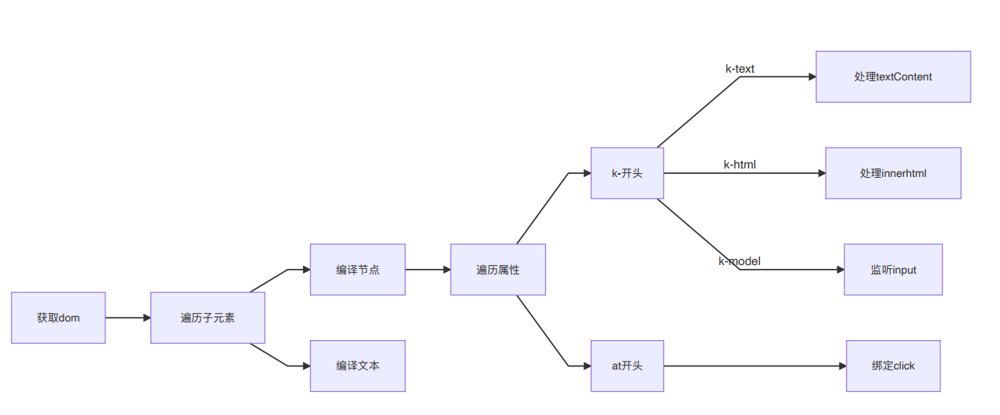

# MVVM模式 数据响应式、模板引擎及渲染
 数据响应式：监听数据变化并在视图中更新

   Object.defineProperty()

   Proxy

 模板引擎：提供描述视图的模板语法

    插值： {{}}

    指令：v-bind, v-on, v-model, v-for, v-if

 渲染：如何将模板转换为html

    模板 => vdom => dom


# Vue中数据响应化
 1、new Vue()首先执行初始化，对data执行响应化处理，这个过程发生在Observe中

 2、同时对模板执行编译，找到其中动态绑定的数据，从data中获取并初始化视图，这个过程发生在Compile中

 3、同时定义一个更新函数和Watcher,将来对应数据变化时Watcher会调用更新函数

 4、由于data的某个key在一个视图中可能出现多次，所以每个key都需要一个管家Dep来管理多个Watcher

 5、将来data中数据一旦发生变化，会首先找到对应的Dep,通知所有Watcher执行更新函数

 Vue：框架构造函数，执行初始化 

 Observer：执行数据响应化(分辨数据时对象还是数组)

 Compile：编译模板，初始化视图，收集依赖(更新函数、watcher创建)

 

 Watcher：执行跟新函数(更新dom)

 Dep: 管理多个Watcher，批量更新

# Vue依赖收集：
视图中会用到data中某个key，这称为依赖。同一个key可能出现多次，每次都需要收集出来用一个Watcher来维护它们，此过程称为依赖收集。多个Watcher需要一个Dep来管理，需要更新时由Dep统一通知。
# 实现思路
1、defineReactive时为每一个key创建一个Dep实例

2、初始化视图时读取某个key,例如nanme1,创建一个watcher1

3、由于触发name1的getter方法，便将watcher1添加到name1对应的Dep中

4、当name1更新，setter触发时，便可通过对应Dep通知其管理所有watcher更新


# 异步更新队列
事件循环Event Loop:浏览器为了协调事件处理、脚本执行、网络请求和渲染等任务而制定的工作机制。

宏任务：浏览器完成一个宏任务，在下一个宏任务执行开始前，会对页面进行重新渲染。主要包括创建文档对象、解析HTML、执行主线JS代码以及各种事件如页面、输入、网络事件和定时器。

微任务：微任务是更小的任务，在当前宏任务执行结束后立即执行的任务。如果存在微任务，浏览器会清空微任务之后再重新渲染。

异步：只要侦听到数据变化，Vue将会开启一个队列，并缓冲在同一事件循环中发生的所有数据变更。

批量：如果同一个watcher被多次触发，只会被推入到队列中一次。去重对于避免不必要的计算和DOM操作是非常重要的。然后，在下一个的事件循环tick中，Vue刷新队列执行实际工作。

异步策略：Vue在内部对异步队列尝试使用原生的Promise.then、MutationObserver或setImmediate。如果执行环境不支持则会采用setTimeout代替。

# 虚拟DOM
对DOM的JS抽象表示，是JS对象，能够描述DOM结构和关系。应用的各种状态变化会作用于虚拟DOM，最终映射到DOM上。

虚拟DOM轻量、快速：当它们发生变化的时候通过新旧虚拟DOM比对可以得到最小的DOM操作量，配合异步更新策略减少刷新频率，从而提升性能。

跨平台：将虚拟DOM更新转换为不同运行时特殊操作实现跨平台。

vue2.0中每一个组件一个watcher实例，这样状态变化时只能通知到组件，再通过引入虚拟DOM去进行比对和渲染。

# 模板编译
将模板(template)转换为渲染函数(render)  vue2.0需要用到VNode描述视图以及各种交互，手写显然不切实际，因此用户只需要编写类似HTML代码的Vue模板，通过编译器将模板转换为可以返回VNode的render函数。

若指定template或者el选项，则会执行编译。编译分为三步：解析、优化、生成

解析parse 解析器将模板解析为抽象语法树，基于AST可以做优化或者代码生成工作。解析器分为HTML解析器、文本解析器、过滤器解析器

优化 optimize 优化器的作用是在AST中找出静态子树并打上标记。静态子树是在AST中永远不变的节点，如纯文本节点。

标记静态子树的好处：每次重新渲染，不需要为静态子树创建新的节点；虚拟DOM中patch时，可以跳过静态子树。

代码生成 generate 将AST转换成渲染函数的内容，即代码字符串。


# vue-principle-practice

## Project setup
```
yarn install
```

### Compiles and hot-reloads for development
```
yarn serve
```

### Compiles and minifies for production
```
yarn build
```

### Lints and fixes files
```
yarn lint
```

### Customize configuration
See [Configuration Reference](https://cli.vuejs.org/config/).

